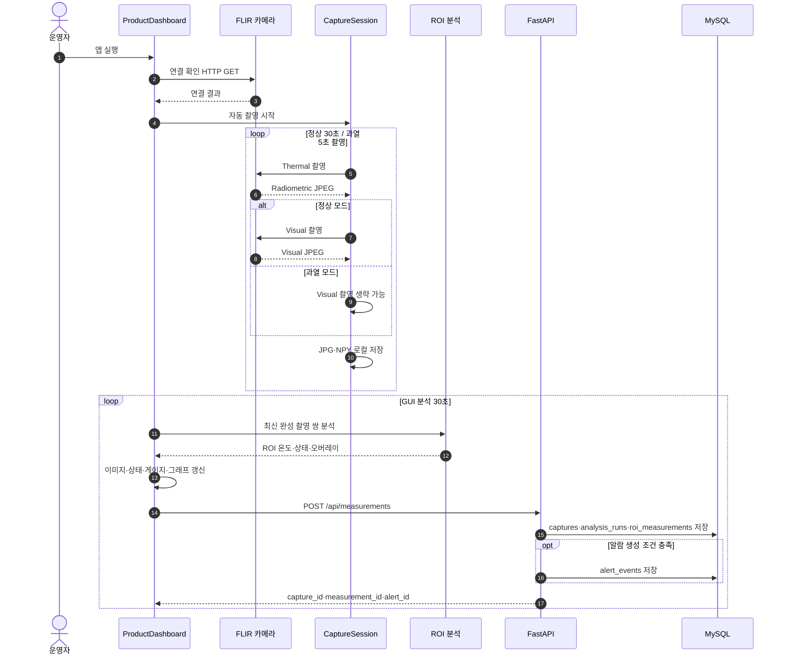
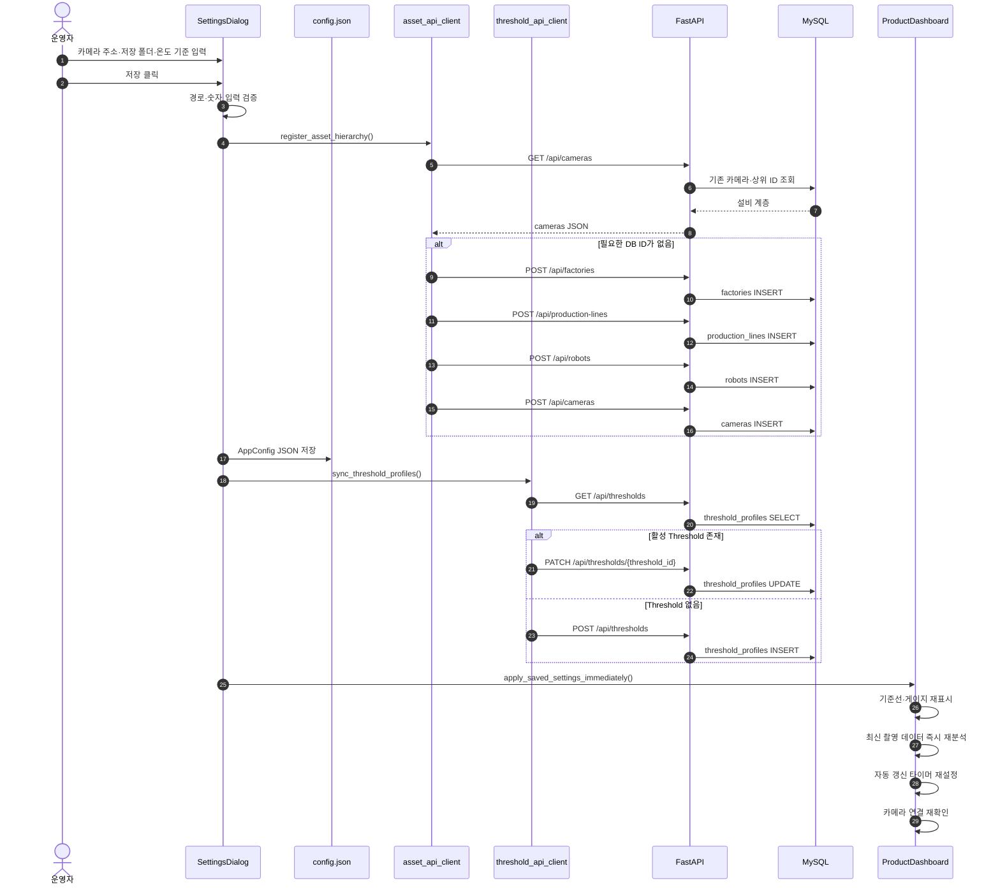
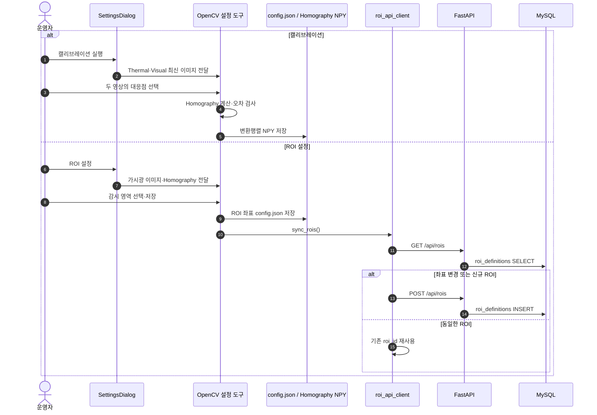
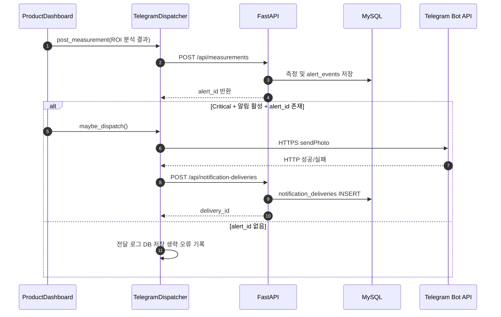
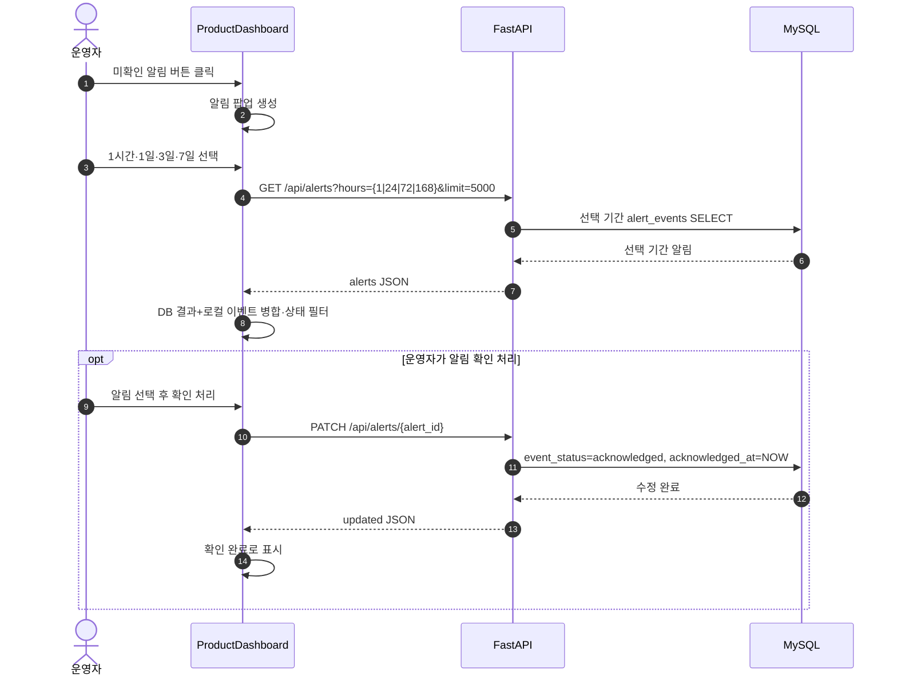
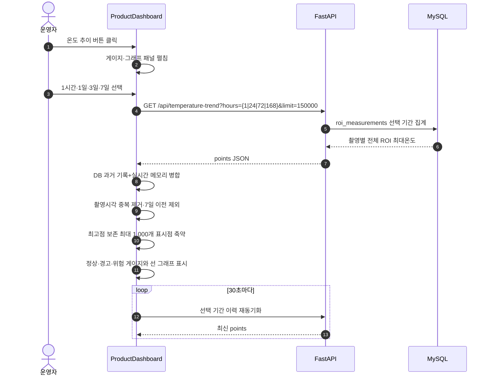
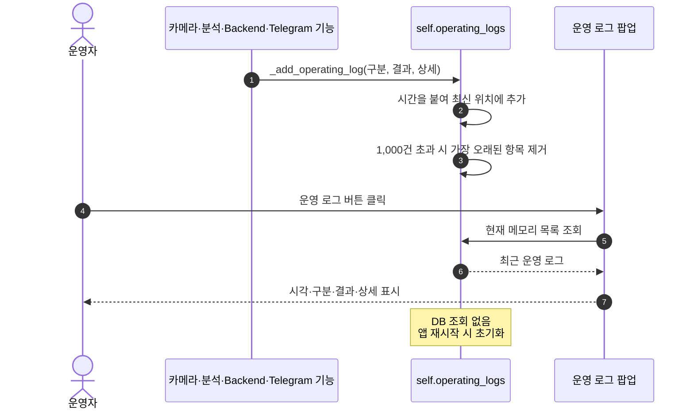

# ThermoGuard UI 시퀀스 다이어그램

## 1. UI 명세서 검토 및 교정 결과

첨부된 `UI명세서.xls`과 현재 코드를 대조한 결과다.

| 항목 | 기존 내용 | 교정 내용 |
|---|---|---|
| 설정 파일 | `config.json` | 현재 코드와 일치하므로 유지 |
| 화면 갱신 주기 | 정상 30초 / 경고 5초 | 카메라 촬영은 정상 30초·과열 5초, GUI 분석·DB 동기화는 30초로 구분 |
| 미확인 알림 | 최근 선택 기간 | 1시간·1일·3일·7일 중 선택 |
| 온도 추이 | 선택 기간 | DB의 1시간·1일·3일·7일 중 선택 + 실시간 측정값 병합 |
| 온도 그래프 표시 | 온도 이력 표시 | 원본은 최대 7일치를 유지하고 화면은 최고점을 보존해 최대 1,000개 표시점으로 축약 |
| Telegram 로그인 | 텔레그램 계정 접속 | 사용자 계정 로그인이 아니라 Bot Token·Chat ID 검증 |
| 환경설정 저장 | 설정값 저장 | `config.json` 저장, 설비·ROI·Threshold DB 동기화, 그래프·게이지 갱신, 최신 데이터 재분석 |
| 운영 로그 | 명세 누락 | DB가 아닌 `self.operating_logs` 런타임 메모리에 최근 1,000건 보관, 앱 재시작 시 초기화 |
| 카메라 연결 표시 | 별도 연결 라벨로 표현 | 현재는 헤더 시스템 상태·API 안정성 표시에 통합 |
| 온도 화면 형태 | 팝업으로 오해 가능 | 현재 메인 화면 하단에서 펼침·접힘되는 패널 |

## 2. 전체 모니터링 시퀀스

## 3. 환경설정 저장 및 즉시 동기화

## 4. ROI 설정·캘리브레이션 시퀀스

## 5. Critical 알림·Telegram·전달 로그

## 6. 기간 선택 알림 팝업

## 7. 기간 선택 온도 추이

## 8. 운영 로그

## 9. 동기·비동기 기준

| 기능 | 방식 | 주기 |
|---|---|---|
| 환경설정 입력 검증·`config.json` 저장 | 동기 | 사용자 저장 요청 시 |
| 설비 계층·ROI·Threshold API 동기화 | 동기 | 설정 저장 시 |
| 카메라 연결 확인 | 비동기 | 앱 시작·설정 저장·재시작 시 |
| 자동 카메라 촬영 | 비동기 | 정상 30초, 과열 5초 |
| GUI 분석·화면 갱신 | 비동기 | 30초 |
| 알림 이력 DB 동기화 | 비동기 | 팝업 열기·새로고침·30초 유지보수 |
| 온도 이력 DB 동기화 | 비동기 | 패널 열기·30초 |
| Telegram 전송 | 비동기 | Critical 알람 발생 시 |
| 운영 로그 표시 | 동기 | 팝업 열기 시 메모리에서 즉시 표시 |

## 10. 발견된 추가 개선 후보

1. 운영 로그는 재시작 시 사라지므로 장기 이력이 필요하면 DB 테이블·저장 API·조회 API가 필요하다.
2. 알림·온도 조회는 `hours=1|24|72|168`로 제한하여 임의의 과도한 범위 조회를 방지한다.
3. 설정 저장은 여러 DB API를 순차 호출하므로 중간 실패 시 로컬 설정과 DB 상태가 다를 수 있다. 완전한 원자적 적용이 필요하면 Backend 통합 설정 API가 필요하다.
4. 헤더의 카메라·Backend 상태는 일부 통합되어 있어, 어느 연결이 실패했는지 별도 표시하면 운영자가 원인을 더 빨리 판단할 수 있다.
